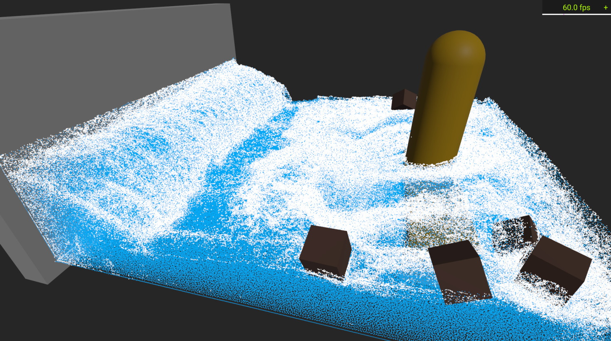
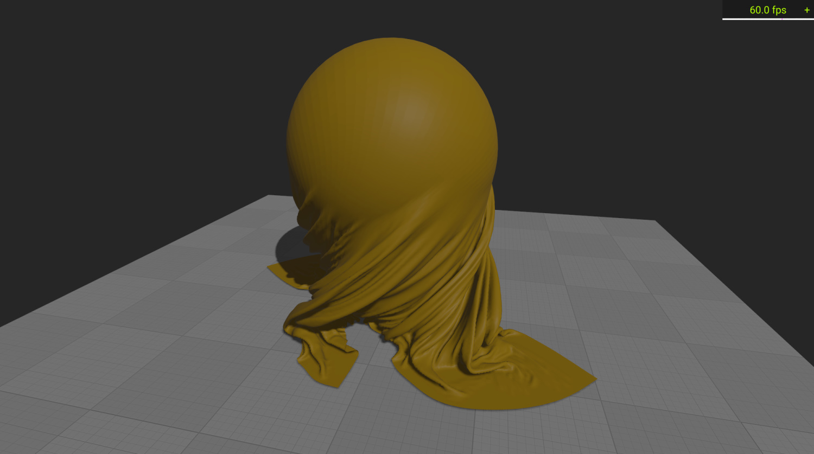

# physx-jni

[](https://opensource.org/licenses/MIT)
[](https://maven-badges.herokuapp.com/maven-central/de.fabmax/physx-jni)


Java JNI bindings for Nvidia [PhysX 5.3.0](https://github.com/NVIDIA-Omniverse/PhysX).

## How to use
The library is published on maven central, so you can easily add this to your dependencies:

### Desktop Java
```
dependencies {
    // java bindings
    implementation("de.fabmax:physx-jni:2.3.1")
    
    // native libraries - you can add the one matching your system or all
    runtimeOnly("de.fabmax:physx-jni:2.3.1:natives-windows")
    runtimeOnly("de.fabmax:physx-jni:2.3.1:natives-linux")
    runtimeOnly("de.fabmax:physx-jni:2.3.1:natives-macos")
    runtimeOnly("de.fabmax:physx-jni:2.3.1:natives-macos-arm64")
}
```

### Android
The Android version of the library is packaged as a single `aar` archive containing both java classes
and native libs:
```
dependencies {
    implementation("de.fabmax:physx-jni-android:2.3.1")
}
```

## Library Coverage

This is still work in progress, but the bindings already include most major parts of the PhysX SDK:
- [x] Basics
    - Static and dynamic actors
    - All geometry types (box, capsule, sphere, plane, convex mesh, triangle mesh and height field)
- [x] All joint types (revolute, spherical, prismatic, fixed, distance and D6)
- [x] Articulations
- [x] Vehicles
- [x] Character controllers
- [ ] CUDA (requires a Platform with CUDA support, see [below](#cuda-support))
    - [x] Rigid bodies
    - [x] Particles (Fluids + Cloth)
    - [ ] Soft bodies
- [x] Scene serialization

The detailed list of mapped functions is given by the [interface definition files](physx-jni/src/main/webidl).
The Java classes containing the actual bindings are generated from these files during build.

After build (or after running the corresponding gradle task `generateJniBindings`) the generated Java
classes are located under `physx-jni/src/main/generated`.

### Supported platforms:
- Windows (x86_64)
- Linux (x86_64)
- MacOS (x86_64, and arm64)
- Android (arm-v8 (aarch64) only for now)
 
Moreover, there is also a version for javascript/webassembly:
[physx-js-webidl](https://github.com/fabmax/physx-js-webidl).

### Examples
You can take a look at [HelloPhysX.java](physx-jni/src/test/java/de/fabmax/physxjni/HelloPhysX.java) for a
hello world example on how to use the library. There also are a few
[tests](https://github.com/fabmax/physx-jni/tree/main/physx-jni/src/test/java/de/fabmax/physxjni) with slightly
more advanced examples (custom simulation callbacks, triangle mesh collision, custom filter shader, etc.).

To see a few real life demos you can take a look at my [kool](https://github.com/fabmax/kool) demos:

- [Vehicle](https://fabmax.github.io/kool/kool-js/?demo=phys-vehicle): Vehicle demo with a racetrack and a few obstacles.
- [Character](https://fabmax.github.io/kool/kool-js/?demo=phys-terrain): 3rd person character demo on an island.
- [Ragdolls](https://fabmax.github.io/kool/kool-js/?demo=phys-ragdoll): Simple Ragdoll demo.
- [Joints](https://fabmax.github.io/kool/kool-js/?demo=phys-joints): A chain running over two gears.
- [Collision](https://fabmax.github.io/kool/kool-js/?demo=physics): Various collision shapes.

> *__Note:__ These demos run directly in the browser and obviously don't use this library, but the webassembly version mentioned
> above. However, the two are functionally identical, so it shouldn't matter too much. The JNI version is much faster
> though.*

The particle simulation unfortunately requires CUDA and therefore only works on Windows / Linux systems with an Nvidia
GPU. Here are a few images what this can look like:

| Fluid Simulation                    | Cloth Simulation                    |
|-------------------------------------|-------------------------------------|
|  |  |

Simplified non-graphical versions of the two scenes are available in source as tests:
[FluidTest](https://github.com/fabmax/physx-jni/blob/main/physx-jni/src/test/java/de/fabmax/physxjni/FluidTest.java) and
[ClothTest](https://github.com/fabmax/physx-jni/blob/main/physx-jni/src/test/java/de/fabmax/physxjni/ClothTest.java)
They are more or less 1:1 translations of the corresponding PhysX example snippets.

### Documentation
The generated bindings contain most of the original documentation converted to javadoc. For further reading
there is also the official
[PhysX documentation](https://nvidia-omniverse.github.io/PhysX/physx/5.3.0/index.html).

### Things to consider when working with native objects
Whenever you create an instance of a wrapper class within this library, this also creates an object on the native
side. Native objects are not covered by the garbage collector, so, in order to avoid a memory leak, you have to
clean up these objects yourself when you are done with them.

Here is an example:
```java
// create an object of PxVec3, this also creates a native PxVec3
// object behind the scenes.
PxVec3 vector = new PxVec3(1f, 2f, 3f);

// do something with vector...

// destroy the object once you are done with it
vector.destroy();
```

This approach has two potential problems: First, as mentioned, if you forget to call destroy(), the memory on the
native heap is not released resulting in a memory leak. Second, creating new objects on the native heap comes with
a lot of overhead and is much slower than creating a new object on the Java side.

These issues aren't a big problem for long living objects, which you create on start-up and use until you exit
the program. However, for short-lived objects like, in many cases, `PxVec3` this can have a large impact. Therefore,
there is a second method to allocate these objects: Stack allocation. To use this, you will need some sort of
memory allocator like LWJGL's MemoryStack. With that one the above example could look like this:
```java
try (MemoryStack mem = MemoryStack.stackPush()) {
    // create an object of PxVec3. The native object is allocated in memory
    // provided by MemoryStack
    PxVec3 vector = PxVec3.createAt(mem, MemoryStack::nmalloc, 1f, 2f, 3f);
    
    // do something with vector...
    // no explicit destroy needed, memory is released when we leave the scope
}
```
While the `PxVec3.createAt()` call looks a bit more complicated, this approach is much faster and comes without the
risk of leaking memory, so it should be preferred whenever possible.

### Java Callbacks

At a few places it is possible to register callbacks, e.g., `PxErrorCallback` or
`PxSimulationEventCallback`. In order to implement a callback, the corresponding Java callback class has to be
extended. The implementing class can then be passed into the corresponding PhysX API.

Here's an example how this might look:

```java
// implement callback
public class CustomErrorCallback extends PxErrorCallbackImpl {
    @Override
    public void reportError(PxErrorCodeEnum code, String message, String file, int line) {
        System.out.println(code + ": " + message);
    }
}

// register / use callback
CustomErrorCallback errorCb = new CustomErrorCallback();
PxFoundation foundation = PxTopLevelFunctions.CreateFoundation(PX_PHYSICS_VERSION, new PxDefaultAllocator(), errorCb);
```

### User Data

Several PhysX classes (e.g. `PxActor`, `PxMaterial`, ...) have a userData field, which can be used to store an arbitrary
object reference. Since the native userData field is a void pointer, a wrapper class `JavaNativeRef` is needed to store
a java object reference in it:

```java
PxRigidDynamic myActor = ...

// set user data, can be any java object, here we use a String:
myActor.setUserData(new JavaNativeRef<>("Arbitrary data"));

// get user data, here we expect it to be a String:
JavaNativeRef<String> userData = JavaNativeRef.fromNativeObject(myActor.getUserData());
System.out.println(userData.get());
```

### CUDA Support

PhysX supports accelerating physics simulation with CUDA (this, of course, requires an Nvidia GPU). However,
using CUDA requires different runtime libraries, which are not available via maven central. Instead, you can grab them
from the [releases section](https://github.com/fabmax/physx-jni/releases) (those suffixed with `-cuda`).
Apart from that, enabling CUDA acceleration for a scene is straight forward:

```java
// Setup your scene as usual
PxSceneDesc sceneDesc = new PxSceneDesc(physics.getTolerancesScale());
sceneDesc.setCpuDispatcher(PxTopLevelFunctions.DefaultCpuDispatcherCreate(8));
sceneDesc.setFilterShader(PxTopLevelFunctions.DefaultFilterShader());

// Create the PxCudaContextManager
PxCudaContextManagerDesc desc = new PxCudaContextManagerDesc();
desc.setInteropMode(PxCudaInteropModeEnum.NO_INTEROP);
PxCudaContextManager cudaMgr = PxCudaTopLevelFunctions.CreateCudaContextManager(foundation, desc);

// Check if CUDA context is valid / CUDA support is available
if (cudaMgr != null && cudaMgr.contextIsValid()) {
    // enable CUDA!
    sceneDesc.setCudaContextManager(cudaMgr);
    sceneDesc.getFlags().set(PxSceneFlagEnum.eENABLE_GPU_DYNAMICS);
    sceneDesc.setBroadPhaseType(PxBroadPhaseTypeEnum.eGPU);
    
    // optionally fine tune amount of allocated CUDA memory
    // PxgDynamicsMemoryConfig memCfg = new PxgDynamicsMemoryConfig();
    // memCfg.setStuff...
    // sceneDesc.setGpuDynamicsConfig(memCfg);
} else {
    System.err.println("No CUDA support!");
}

// Create scene as usual
PxScene scene = physics.createScene(sceneDesc);
```

CUDA comes with some additional overhead (a lot of data has to be copied around between CPU and GPU). For
smaller scenes this overhead seems to outweigh the benefits and physics computation might actually be slower than with
CPU only.
I wrote a simple [CudaTest](physx-jni/src/test/java/de/fabmax/physxjni/CudaTest.java), which runs a few simulations
with an increasing number of bodies. According to this the break even point is around 5k bodies. At 20k boxes the CUDA
version runs about 3 times faster than the CPU Version (with an RTX 2080 / Ryzen 2700X). The results may be different
when using other body shapes (the test uses boxes), joints, etc.

## Building
You can build the bindings yourself. However, this requires `cmake`, `python3` and the C++ compiler appropriate to your
platform (Visual Studio 2022 (Community) on Windows / clang on Linux):
```
# Clone this repo
git clone https://github.com/fabmax/physx-jni.git

# Enter that directory
cd physx-jni

# Download submodule containing the PhysX source code
git submodule update --init

# Optional, but might help in case build fails
./gradlew generateNativeProject

# Build native PhysX (requires Visual Studio 2022 (Community) on Windows / clang on Linux)
./gradlew buildNativeProject

# Generate Java/JNI code and build library
./gradlew build
```